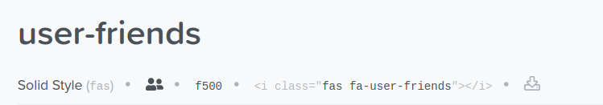

# Exercise 1 - Use font-awesome icons and text together

Use font-awesome to build a list with three li entries.

See the following image:

Instructions:

- Pick two different icons from font-awesome (which ones does not matter)
- Place them side by side with some text in between - like in the image. Create three list entries like that
- Hide / remove the default bullet points from the list
- Remove the default padding from the list
- Use span tags around the text between the icons. That way you can "talk to it" via CSS to select & style it
- Align the text relative to the icons using vertical-align like seen in the image (top, bottom, middle)
- Use border around li and margin of 20px between the li tags to see the text alignments better
- At the end: Strike-through the span texts with the text-decoration attribute (google the right value for this on w3schools)

Create the needed HTML and CSS in one file (index.html + embedded CSS).

## Instructions for font-awesome usage

Import font-awesome like any other stylesheet with the link tag in the head section.

Link to the font-awesome stylesheet:  
<https://cdnjs.cloudflare.com/ajax/libs/font-awesome/5.9.0/css/all.min.css>

Search for icons:  
<https://fontawesome.com/icons?d=gallery>

How to grab the icon code:
Click on an icon that you want. Then you get to the icon details view, like this one:

Click on the HTML / CSS code (in the line below the title) to copy it. Now the icon code is in the clipboard. You can now paste it into Visual Studio Code.

General instructions on usage of icons (when you got stuck):  
<https://fontawesome.com/how-to-use/on-the-web/referencing-icons/basic-use>
