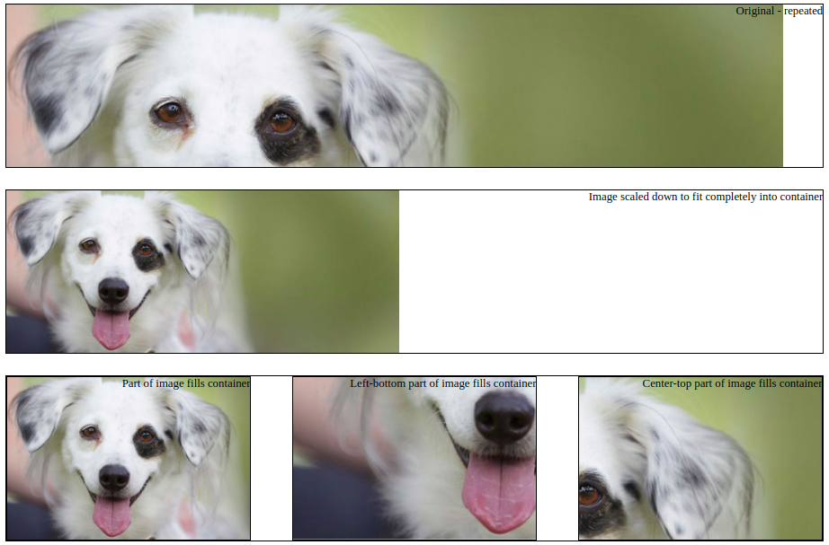

# Exercise 1 - Background images

We have the following image:

The url to the image:  
https://d17fnq9dkz9hgj.cloudfront.net/breed-uploads/2018/09/dog-landing-hero-lg.jpg?bust=1536935129&width=1080

Now we want to place it as background in DIVs.

Instructions:

- Apply the given image as background to the base class "img-dog" 
- Prevent the background image from repeating
- Dimension the images in the divs so they look like in the the result image below
- CSS to use: background-image, background-repeat, background-size, background-position

Final result:  

