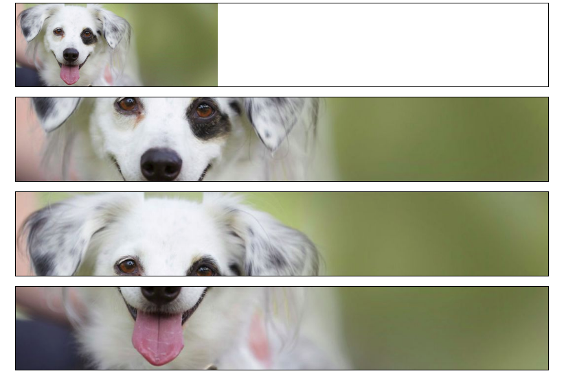

# Exercise 2 - Content images with object-fit

We have our dog image again in the file index.html.
Four times actually.  

If we set a width and height on an image, by default it stretches
to fill out the given space completely.  

Open file index.html in the browser to see that. 

This does not look so cool, does it? 

We now want to preserve the so called "aspect ratio" (natural relation between width and height, not streching).

Instructions:

- The first image should fit into its container, without any cropping of image parts
- The second image should fill the whole container. Do not use object-position. This will result in equal cropping on left and right site if image has not enough space
- The third image should fill the whole container,
  showing the top left part of the image and cropping the rest
- The fourth image should fill the whole container,
  showing the bottom right part of the image and cropping the rest
- In Browser -> right-click -> Inspect -> activate responsive view. Scaling the viewport width down and test the correct behaviour of the images.

Use CSS properties "object-fit" and "object-position" to realize this!

Final result:

