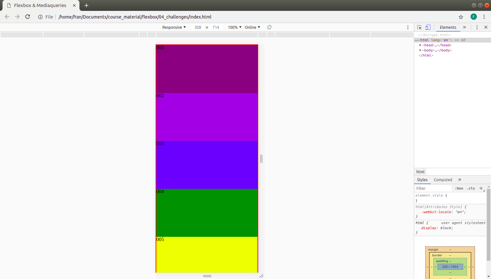

# Challenge 2 - Flex

Create a responsive layout for mobile, tablet and desktop. 

See folder "images" for reference how each layout should look.

Realize these layouts by use of flexbox and media queries. 

Do NOT use nested flexboxes, one flexbox only. Apply "flex-wrap" and "flex-basis" in the media-queries to realize the different widths of the blocks.

MOBILE:

TABLET:

DESKTOP:

