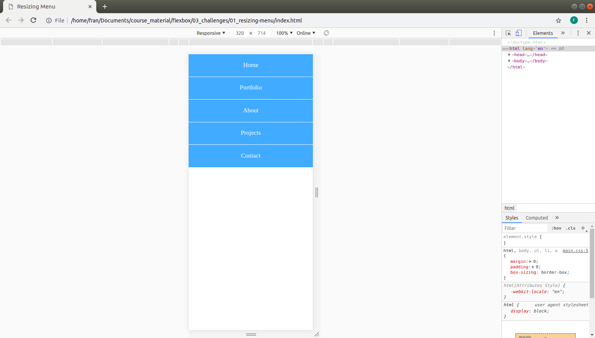
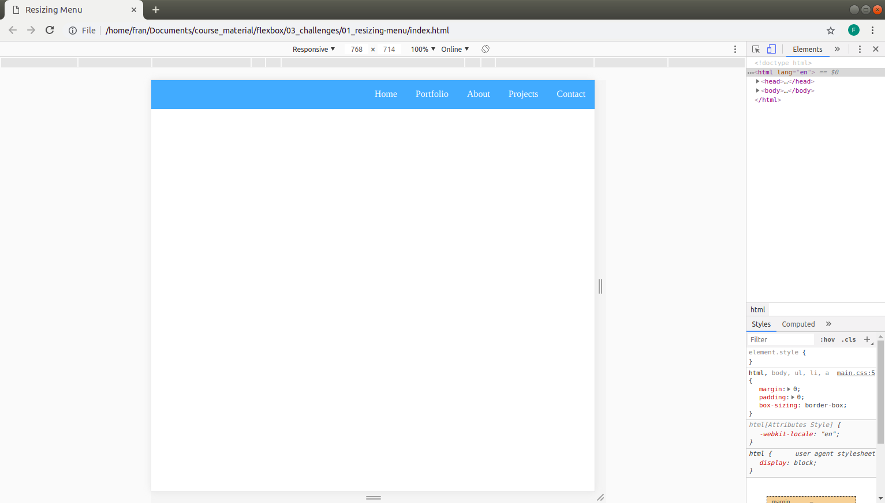

# Challenge 3 - Flex

Create a navigation for mobile - each menu item should take up al the space on the row (one line). NOTE: Add style as needed, eg. borders etc.

Create a navigation for desktop - each menu item should be aligned side-by-side on the far RIGHT of the container

See images for reference:

MOBILE:

DESKTOP:

