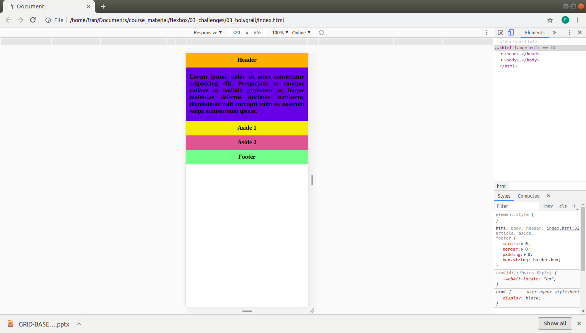
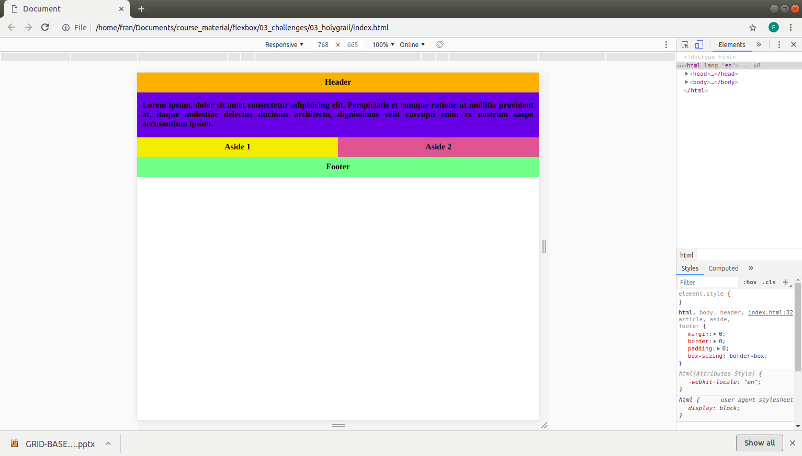
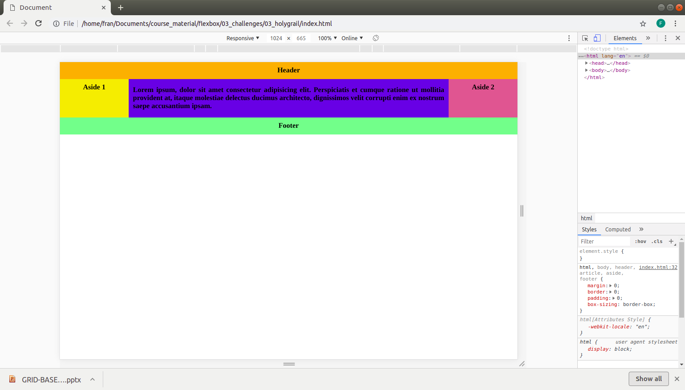

# Challenge 4 - Flex

Use flexbox to style the page as seen in the images. 

Use NESTED flexboxes and media queries to realize the layouts. 

HINT: Use order to style the largest breakpoint

See images for reference:

MOBILE:

TABLET:

DESKTOP:

