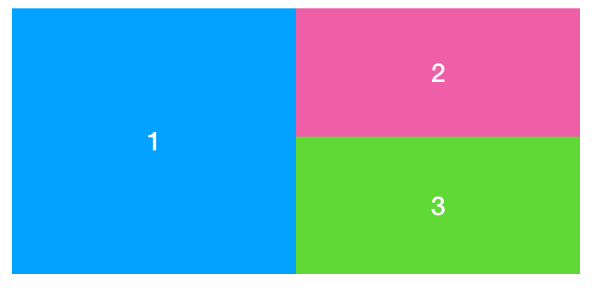

# Challenge 6 - Flex

Realise the layout of the three boxes with nested flexboxes.

 

The layout on the image should take effect at a screen width of 600px and above.

Below 600px the three boxes should be STACKED on top of each other, keeping the order from 1 to 3.

Create the needed HTML and CSS files (index.html and main.css) from scratch and link the CSS file in the HTML document. 

Use the Color-Zilla Browser-Plugin to use the (almost) exact background-colors for your boxes as in the image.

