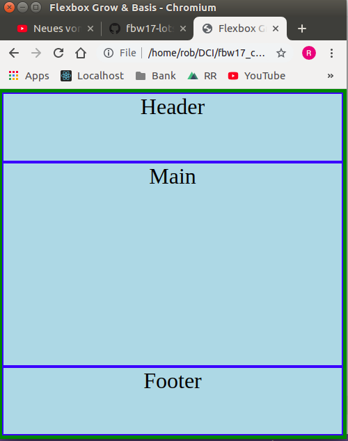

# Challenge 7 - Flex

Realize a layout with the items "header", "main" and "footer".

They should be stacked in one column with a flexbox. Like so:

- HEADER
- MAIN
- FOOTER

The flexbox should take 100 percent of the viewport height. We want no margin and no scrollbars.

The header should get 100px fixed height.
The footer should take 20% of the available height.
The main element should take all remaining height.

**Do NOT use the css "height" attribute to realize this**. Apply flex-basis and flex-grow only to set the height of the items.

End result:

