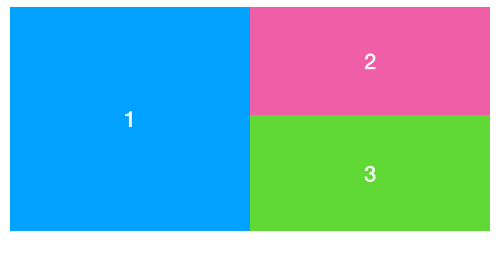

# Challenge 8 - Flex

Realize the layout of the three boxes with ONE (!) flexbox only. 

 

You will need flex-direction, flex-basis and flex-wrap.

The container box should have a fixed height of 300px. 

Create the needed HTML and CSS within one file (index.html + embedded CSS). 

Use the Colorzilla Browser-Plugin to use the (almost) exact background-colors for your boxes as in the image.

