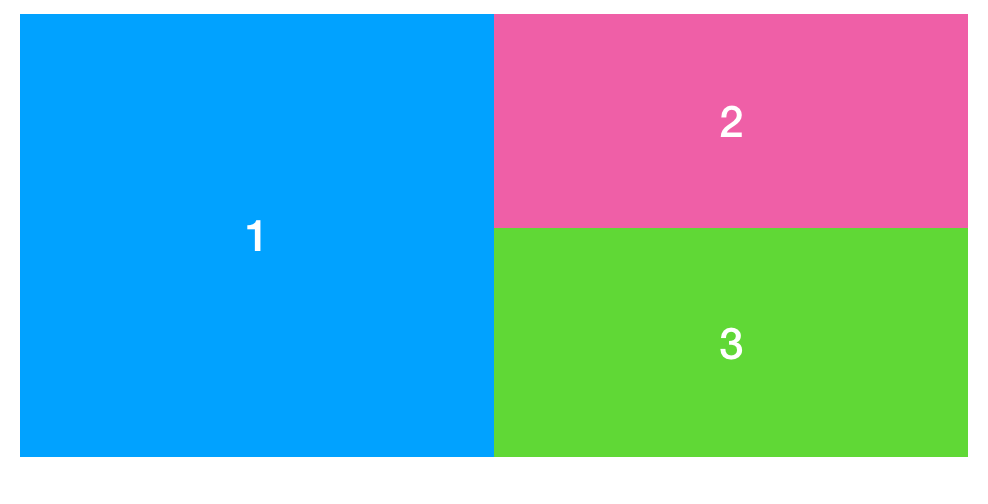

# Challenge 9 - Flex

Realize the layout of the three boxes with ONE (!) flexbox only. Make it responsive. 

MOBILE (till 600px):

TABLET AND DESKTOP (600px and above):

 

The container box should have a fixed height of 300px.

You will need flex-direction, flex-basis and flex-wrap.

Below 600px the three boxes should be STACKED on top of each other. All should have the same height.

At 600px the items should look like on the second image.

Create the needed HTML and CSS in one file (index.html, with embedded CSS).

Start to style your page for mobile only. **So don't reuse your code from challenge 8! Start from scratch**.

When you finished the layout for mobile: Write the media query for tablet / desktop layout (min-width: 600px).

Use the Colorzilla Browser-Plugin again to use the (almost) exact background-colors for your boxes as in the image.

