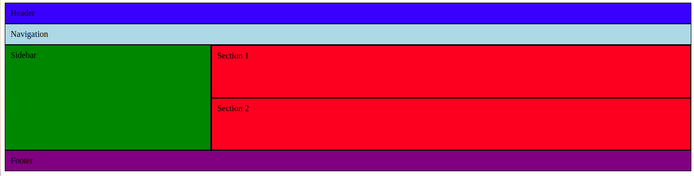

# Layouting - Exercise 1

Please create the layout shown in this image:

Use the file "index.html" as your starting point which has already some boilerplate code.
Find the solution in the file "solution.html"

> Use:
> - Blocks, inline blocks & fixed pixel heights to realise the layout
> - box-sizing: border-box on all layout elements
